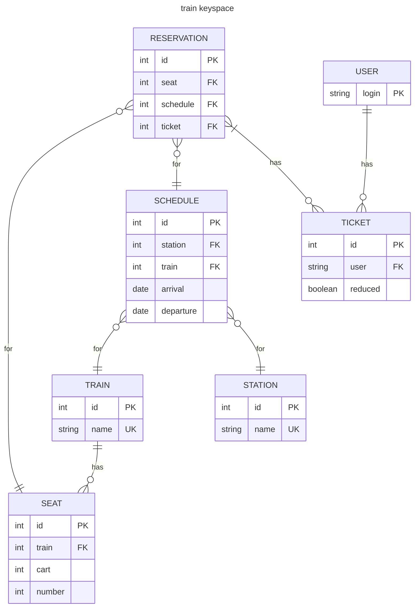

# Train-scheduler

Repo for Big Data and Distributed Systems project.

The project is done with Cassandra and Postgres. The topic is a Train scheduler.

The trains periodically send their location and other sensor information to the database.

Using the GUI, user are able to buy normal and reduced tickets for the chosen trains. They are also able to see the last train location.

## Database schema



## How to run

### GUI

The GUI is a website implemented using React. Simply run:

```bash
npm run dev
```

### Fake trains

To emulate the trains run:

```bash
python scripts/run_trains.py
```
